# ACS (AMR Control System) 사용자 매뉴얼

> **발행일**: 2026년 4월 23일
> **대상 버전**: frontend 0.0.0, backend 1.0.0
> **접속 주소 예시**: http://localhost:3000

본 매뉴얼은 ACS 시스템의 화면별 사용법을 실제 렌더링된 UI 스크린샷과 함께 설명합니다.

---

## 목차

1. [로그인](#1-로그인)
2. [대시보드 개요](#2-대시보드-개요)
3. [AMR 추가](#3-amr-추가)
4. [AMR 상세 확인](#4-amr-상세-확인)
5. [AMR 제거](#5-amr-제거)
6. [AMR 이동 명령](#6-amr-이동-명령)
7. [태스크 확인 및 취소(삭제)](#7-태스크-확인-및-취소삭제)
8. [맵 관리](#8-맵-관리)
9. [통신 로그](#9-통신-로그)
10. [설정 페이지](#10-설정-페이지)
11. [시스템 재시작(PM2)](#11-시스템-재시작pm2)
12. [로그아웃](#12-로그아웃)

---

## 1. 로그인

`/login` 경로에서 관리자 계정으로 로그인합니다.

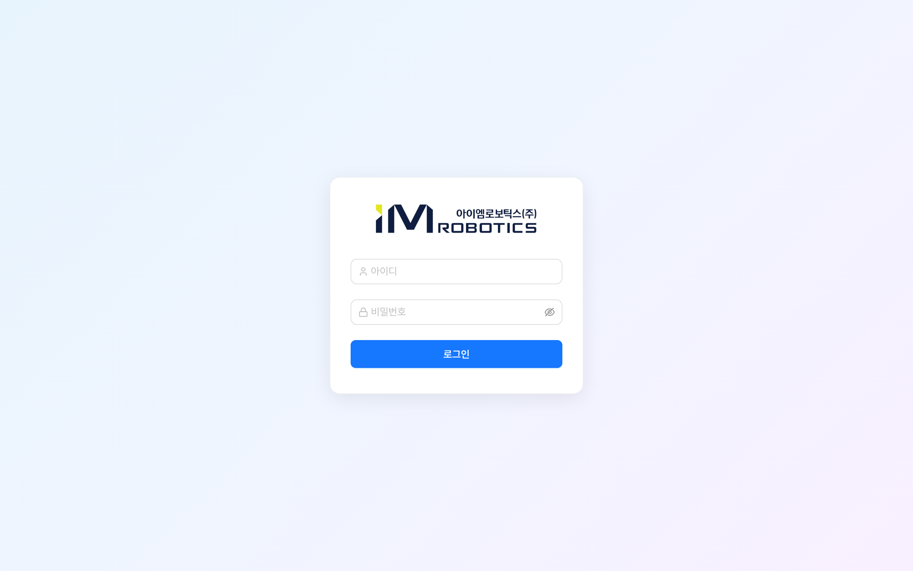

*로그인 페이지 초기 화면*


아이디와 비밀번호를 입력하고 **로그인** 버튼을 클릭합니다.

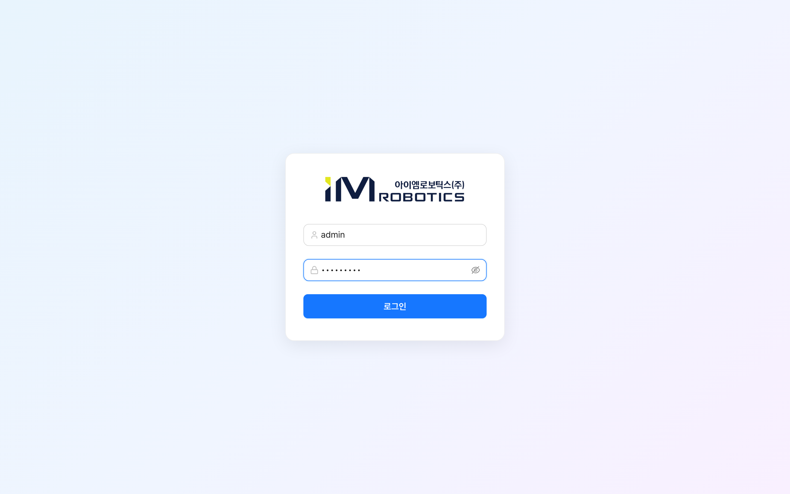

*아이디/비밀번호 입력 완료*


- 입력값이 비어있으면 필드 하단에 “아이디를 입력하세요” / “비밀번호를 입력하세요” 검증 메시지가 표시됩니다.
- 인증 실패 시 우측 상단 토스트로 “로그인에 실패했습니다.” 메시지가 표시됩니다.
- 로그인이 성공하면 `/` (대시보드)로 이동합니다. `role === 'admin'` 계정만 사이드바(맵 관리 / 통신 로그 / 설정)가 표시됩니다.

---

## 2. 대시보드 개요

대시보드는 상단의 **AMR 가로 리스트**와 하단의 **맵 캔버스**로 구성됩니다.

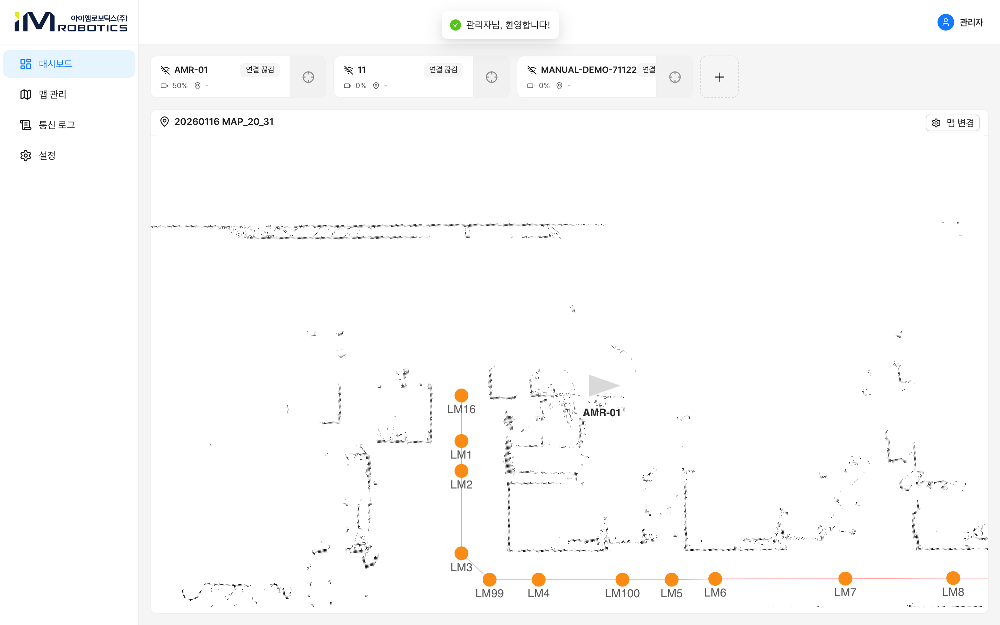

*대시보드 전체 레이아웃*


- **AMR 카드**: 아이콘 + 이름 + 상태 태그(대기/이동/오류/정지/비상정지/연결 끊김), 배터리, 현재 위치, 목적지를 한 줄에 표시합니다.
- **추적 버튼(조준 아이콘)**: AMR 카드 우측의 정사각형 영역을 누르면 해당 AMR을 따라 지도 카메라가 이동합니다. 다시 누르면 추적 해제.
- **+ 버튼**: AMR 리스트 맨 끝의 점선 테두리 박스. 새로운 AMR을 추가합니다.
- **맵 변경 버튼**: 지도 카드 우측 상단의 톱니 아이콘 버튼. 업로드된 맵 중 하나를 선택합니다.

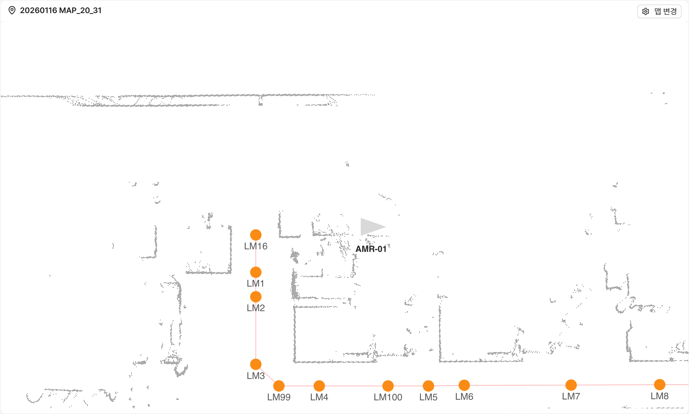

*지도 캔버스*


- **드래그**: 지도를 이동합니다.
- **마우스 휠**: 확대/축소.
- **우클릭**: 빈 공간이 아닌 **스테이션 위에서** 우클릭하면 AMR을 선택해 이동 명령을 전송할 수 있는 메뉴가 뜹니다.

---

## 3. AMR 추가

대시보드 상단의 **+ 버튼**(점선 테두리)을 클릭합니다.

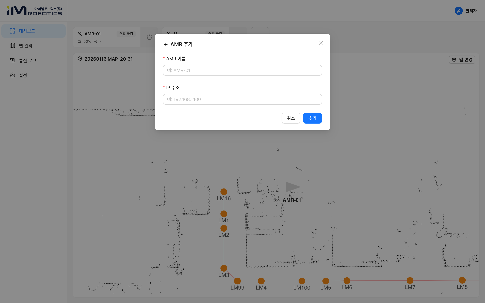

*AMR 추가 모달 초기 상태*


**AMR 이름**과 **IP 주소**를 입력합니다.

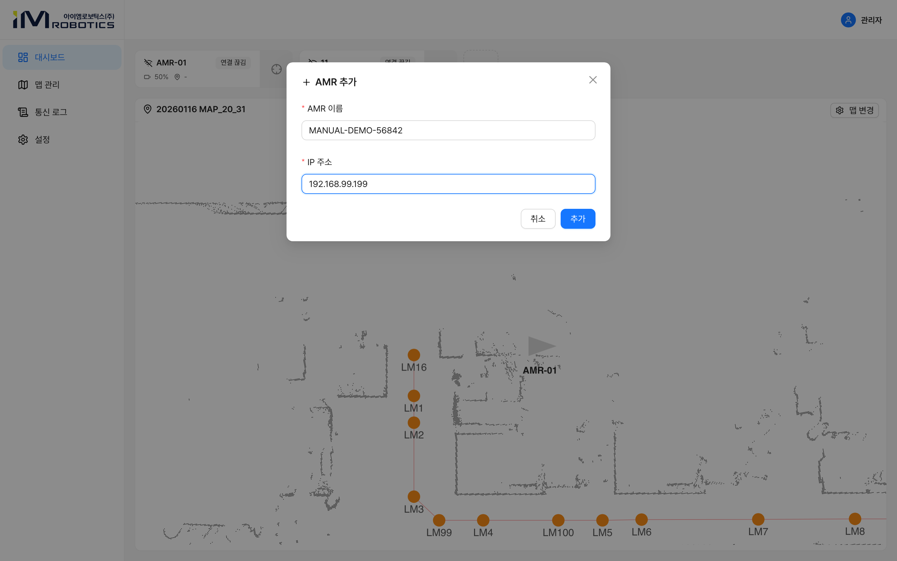

*입력 완료*


- 이름과 IP는 필수입니다.
- **추가** 버튼을 누르면 `POST /api/amr` 요청이 전송되고, 초기 상태는 `NO_CONN`으로 등록됩니다.
- 백엔드의 AMR 모니터 서비스가 해당 IP로 연결되면 상태가 `IDLE / MOVING / STOP / ERROR / E-STOP` 등으로 갱신됩니다.

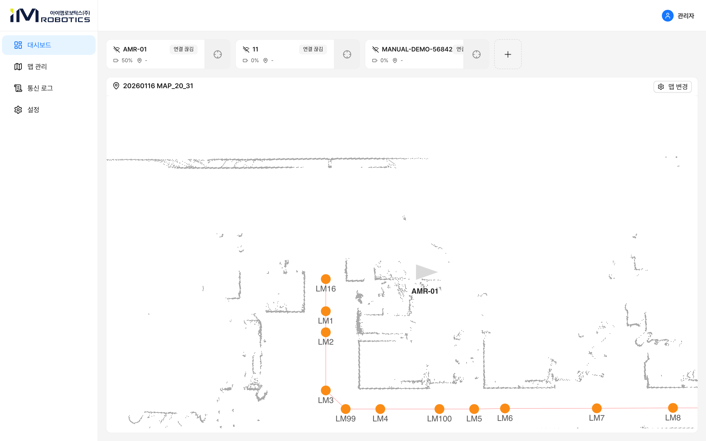

*추가 완료 화면*


---

## 4. AMR 상세 확인

상단 리스트에서 AMR 카드의 **정보 영역**(좌측, 추적 버튼이 아닌 부분)을 클릭하면 상세 모달이 열립니다.

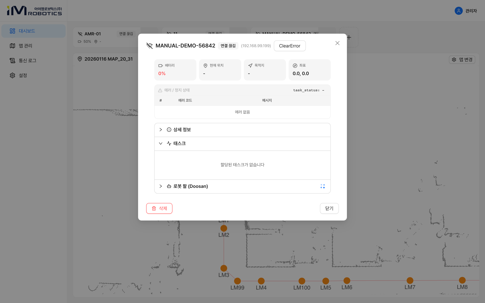

*AMR 상세 모달*


모달은 다음 섹션으로 구성됩니다:

1. **상단 헤더**: 이름, 상태 태그, IP, **ClearError** 버튼(DI 11/12 에러 초기화).
2. **요약 카드 4개**: 배터리, 현재 위치, 목적지, 좌표(`x, y`).
3. **에러 / 정지 상태 테이블**: 발생한 에러 코드와 메시지, `stop_code`, `task_status_raw`를 표시. 이슈가 있으면 붉은 톤으로 강조됩니다.
4. **상세 정보 (접기)**: AMR ID, IP, 각도(°), 맵, 마지막 수신 시간.
5. **태스크**: 해당 AMR에 할당된 태스크 최근 20건. `RUNNING` 태스크는 좌측 파란색 바로 강조되고 상단에 뱃지 카운트가 뜹니다. 20건을 넘으면 “이전 태스크 N건 더보기” 버튼으로 확장 가능.
6. **로봇 팔 (Doosan)**: 관절별 온도/위치/토크/전류 표, ROBOT_STATUS, VISION_ERROR 등. 온도가 50도 이상이면 붉은색, 40도 이상이면 노란색으로 표시됩니다. 2초 주기 폴링.

---

## 5. AMR 제거

**상세 모달 하단 좌측**의 빨간색 **삭제** 버튼을 누르면 확인 Popconfirm이 표시됩니다.

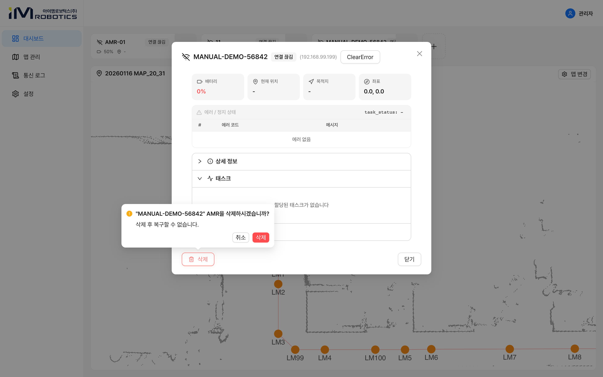

*AMR 삭제 확인*


**삭제**를 최종 확인하면 `DELETE /api/amr/:id`가 호출되고, 리스트에서 해당 AMR이 사라집니다.

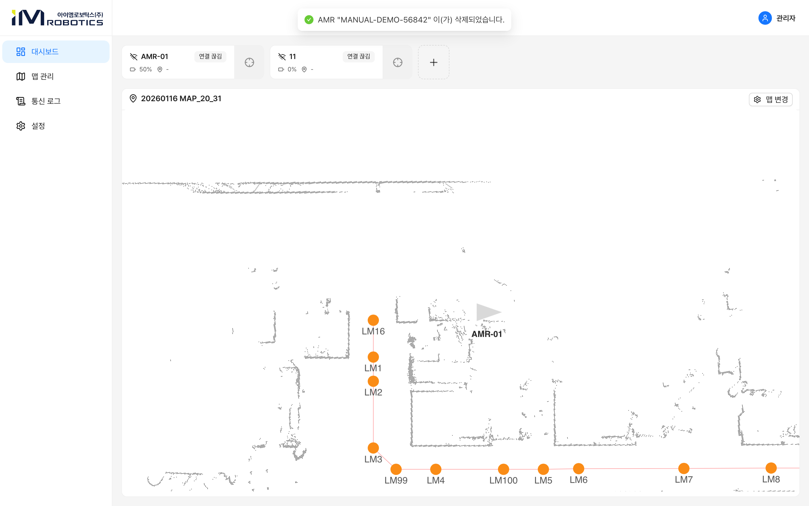

*삭제 완료*


> ⚠️ 삭제 후에는 복구할 수 없습니다. 해당 AMR의 기존 태스크 이력은 DB에 남아있을 수 있습니다.

---

## 6. AMR 이동 명령

AMR을 특정 스테이션으로 보내는 방법은 두 가지입니다.

### 방법 A — 지도에서 우클릭 (권장)

1. 대시보드 하단 지도 캔버스에서 목적지로 사용할 **스테이션 아이콘 위에서 우클릭**합니다.
2. 표시되는 컨텍스트 메뉴에서 **해당 스테이션으로 보낼 AMR**을 선택합니다.
3. 백엔드가 `POST /api/amr/:id/navigate`를 호출해 이동 명령을 전송하고, 성공 시 상단 토스트에 “`<AMR 이름>` → `<스테이션>` 이동 명령 전송 완료” 메시지가 표시됩니다.

> ℹ️ 빈 공간이 아닌 **스테이션 위에서** 우클릭해야 메뉴가 뜹니다.

### 방법 B — 설정 > 이동 지시 테스트 탭 (MES API 시뮬레이션)

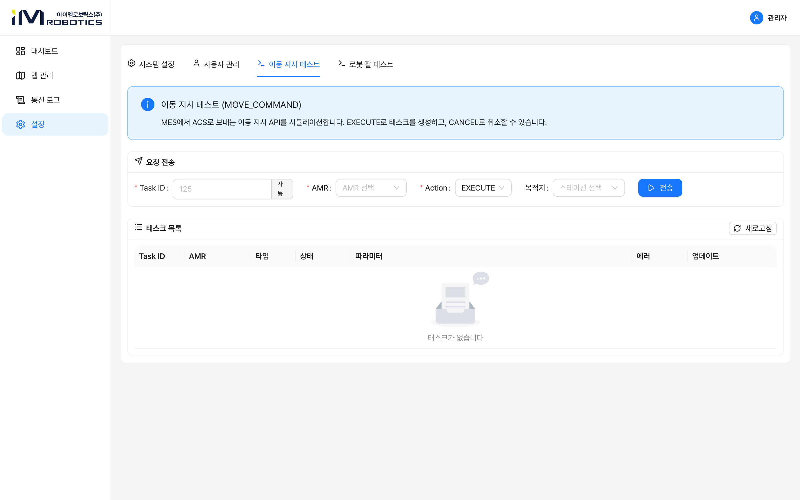

*설정 > 이동 지시 테스트*


1. **Task ID**: 고유 숫자. 우측의 **자동** 텍스트를 클릭하면 현재 시각 기준으로 6자리가 자동 입력됩니다.
2. **AMR**: 목록에서 선택(상태가 함께 표시됨).
3. **Action**: `EXECUTE` — 태스크 생성 및 이동 시작. `CANCEL` — 해당 Task ID 태스크 취소.
4. **목적지**: 현재 맵의 스테이션 중 선택.
5. **전송** 버튼을 누르면 `POST /api/move-command`가 호출되고, 하단에 `result_msg`와 `server_time`이 표시됩니다.

---

## 7. 태스크 확인 및 취소(삭제)

### 7-1. AMR 상세 모달에서 확인

AMR 상세 모달의 **태스크** 섹션에서 해당 AMR에 할당된 최근 태스크를 확인할 수 있습니다. 각 행은 Task ID, 타입(`MOVE`/`ARM`), 상태(`PENDING`/`RUNNING`/`DONE`/`FAILED`/`CANCELED`), 에러 코드, 생성 시각을 표시합니다.

### 7-2. 설정 > 이동 지시 테스트 탭의 태스크 목록


*태스크 목록 표시*


- **상태별 색상**: RUNNING(파랑 processing), FINISHED(초록), ERROR(빨강), CANCELLED(회색), PENDING(주황).
- **새로고침** 버튼 또는 3초 주기 폴링으로 자동 갱신됩니다.

### 7-3. 태스크 취소(삭제)

태스크를 삭제(취소)하려면 해당 태스크의 **Task ID**를 그대로 넣고 Action을 **CANCEL**로 바꿔 전송합니다.

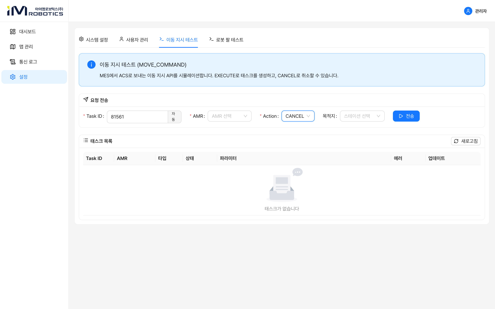

*CANCEL 요청 폼*


- `EXECUTE`로 만들어진 태스크라도 `RUNNING` 중간에 `CANCEL`을 보내면 백엔드가 태스크를 중단 처리하고 상태가 `CANCELLED`로 바뀝니다.
- 로봇 팔 태스크는 **설정 > 로봇 팔 테스트** 탭에서 동일한 방식으로 `CANCEL`을 전송합니다.

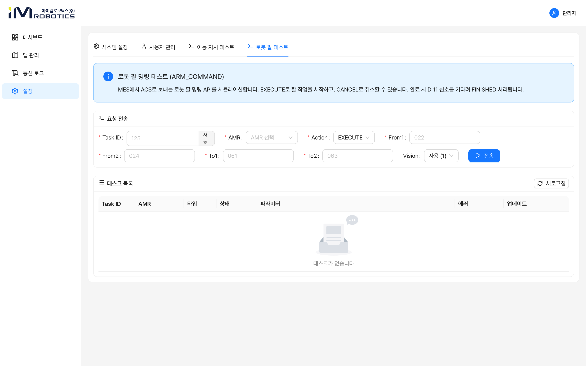

*설정 > 로봇 팔 테스트*


---

## 8. 맵 관리

관리자 계정만 접근 가능합니다. 좌측 사이드바에서 **맵 관리**를 선택합니다.

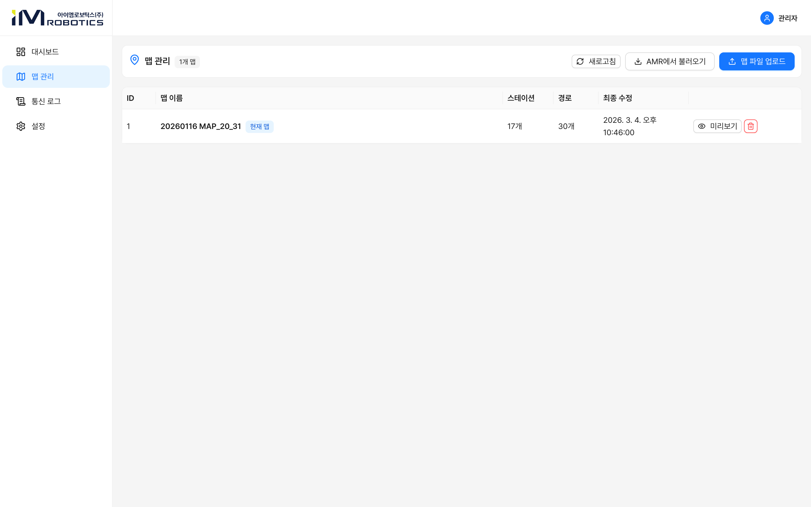

*맵 관리 페이지*


- **업로드**: `.json` 또는 `.smap` 파일 업로드. 업로드 즉시 목록에 추가되며, DB에 스테이션/경로 정보가 함께 저장됩니다.
- **미리보기**: 맵 행의 👁 버튼으로 캔버스에서 스테이션/경로 확인.
- **현재 맵 지정**: ✓ 버튼을 누르면 해당 맵이 대시보드의 기본 맵으로 설정됩니다.
- **AMR 맵 불러오기**: AMR 컨트롤러에서 저장된 맵을 내려받아 ACS에 등록할 수 있습니다.
- **삭제**: 🗑 버튼, 확인 후 DB에서 제거됩니다.

---

## 9. 통신 로그

관리자 전용. ACS 서버가 MES/로봇과 주고받은 요청/응답 로그를 확인합니다.

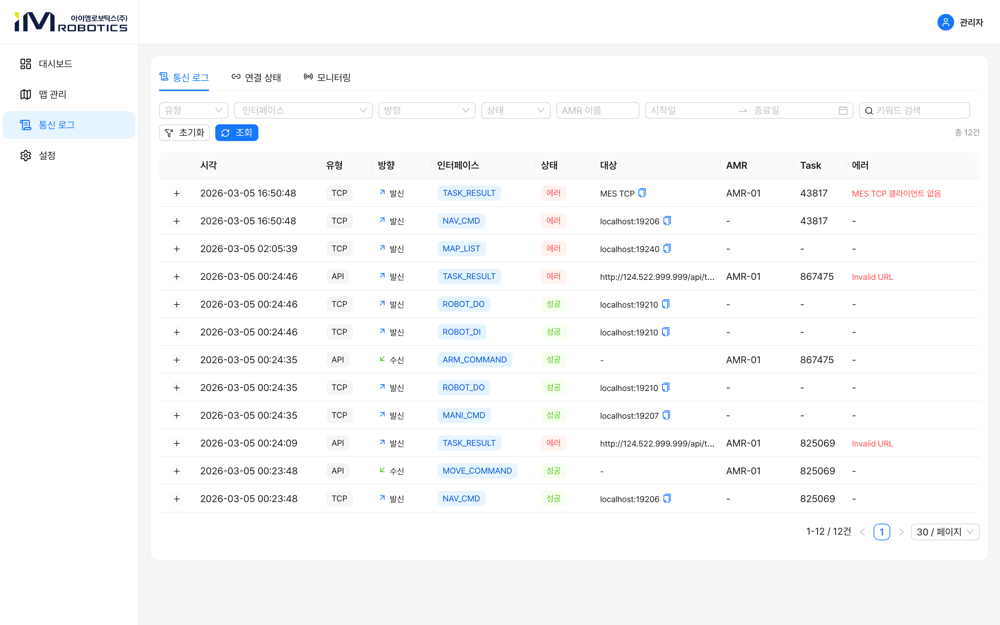

*통신 로그 페이지*


- 방향(IN/OUT), 시간, 엔드포인트, 페이로드, 상태 코드 등을 시간순으로 표시합니다.
- 문제가 의심되는 구간의 요청·응답 원문을 그대로 확인할 수 있어 트러블슈팅에 사용됩니다.

---

## 10. 설정 페이지

관리자 전용. 4개의 탭이 있습니다.

### 10-1. 시스템 설정

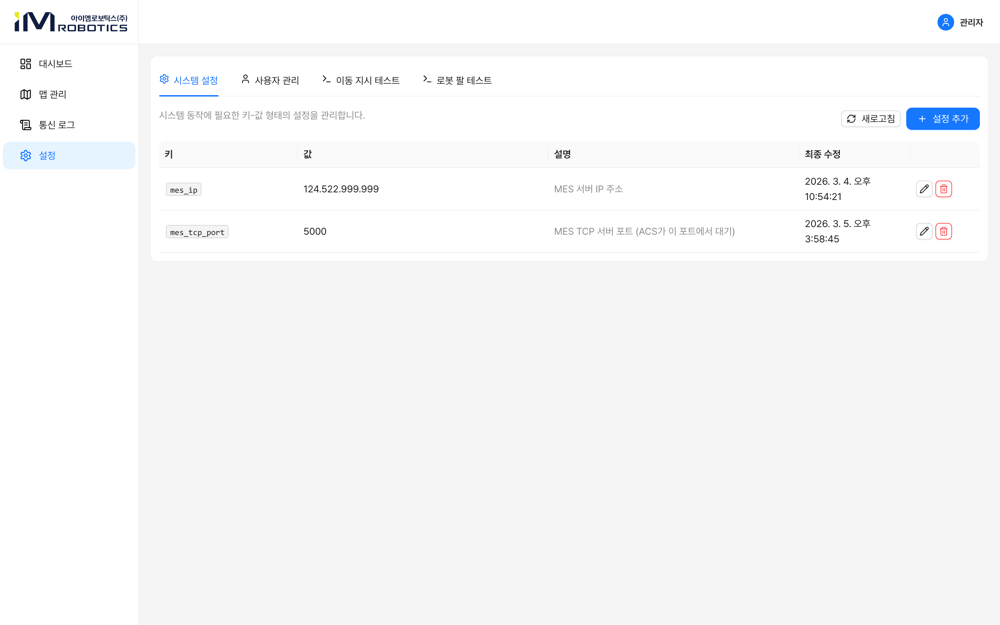

*시스템 설정 탭*


키–값 형태로 시스템 동작에 필요한 파라미터(예: `mes_ip`, 폴링 주기, 타임아웃 등)를 관리합니다. **설정 추가 / 수정(연필 버튼) / 삭제(휴지통)** 기능을 제공합니다.

### 10-2. 사용자 관리

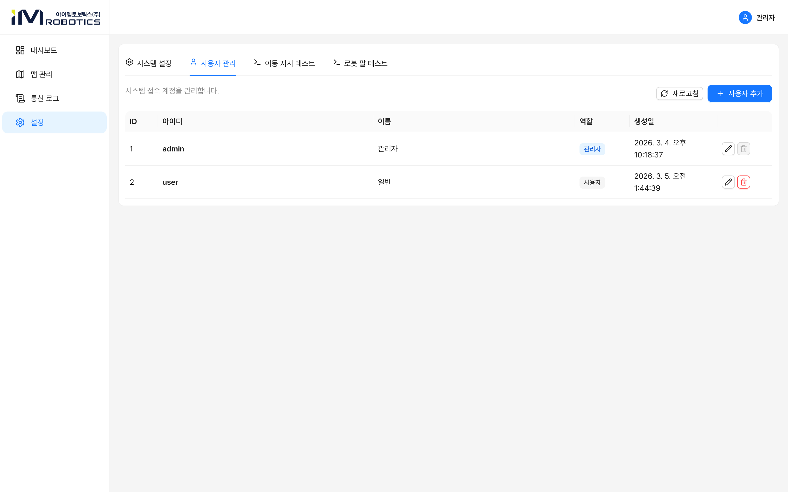

*사용자 관리 탭*


- 시스템 접속 계정을 추가/수정/삭제합니다.
- **역할**: `admin` 또는 `user`. 일반 사용자는 대시보드만 볼 수 있습니다.
- `admin` 계정은 삭제할 수 없도록 보호되어 있습니다.
- 비밀번호는 **수정 시 공란이면 유지**되고, 값이 있으면 새 비밀번호로 교체됩니다.

### 10-3. 이동 지시 테스트

앞서 **6. AMR 이동 명령**, **7. 태스크 확인/취소**에서 설명한 MOVE_COMMAND 시뮬레이터입니다.

### 10-4. 로봇 팔 테스트


*로봇 팔 테스트 탭*


ARM_COMMAND(로봇 팔 이송 작업)를 시뮬레이션합니다. 입력 파라미터는 `from_location_id1/2`, `to_location_id1/2`, `vision_check`(0 또는 1)이며, 완료 시점은 DI11 신호 수신을 기다립니다.

---

## 11. 시스템 재시작(PM2)

ACS 백엔드/프론트엔드는 **PM2**로 관리됩니다(`ecosystem.config.cjs` 기준: `acs-backend`, `acs-frontend-dev`).

터미널에서 다음 명령을 사용합니다.

```bash
# 현재 상태 조회
pm2 status

# 전체 재시작
pm2 restart all

# 개별 재시작
pm2 restart acs-backend
pm2 restart acs-frontend-dev

# 실시간 로그 확인
pm2 logs acs-backend --lines 100
pm2 logs acs-frontend-dev --lines 100

# 멈춘 프로세스만 되살리기
pm2 resurrect

# 시스템 부팅 시 자동 실행 등록
pm2 startup
pm2 save
```

> ⚠️ **`pm2 restart all`**은 서비스가 재기동되는 수 초 동안 프론트엔드 화면이 일시적으로 응답하지 않을 수 있습니다.
> - 연결이 끊긴 AMR은 재기동 후 자동으로 다시 연결 시도됩니다(`autorestart: true`).
> - 긴급 정지가 필요할 땐 `pm2 stop all`, 재개는 `pm2 start all`을 사용합니다.

### 트러블슈팅 체크리스트

1. `pm2 status`에서 `errored`/`stopped` 프로세스가 없는지 확인
2. `pm2 logs acs-backend --lines 200` 로 스택 트레이스 확인
3. 포트 충돌 여부 확인: `lsof -i :3000 -i :5173 -i :8080`
4. DB 접속 가능 여부, 설정 페이지 > **시스템 설정** 값 검증
5. 필요 시 `pm2 flush`로 로그 초기화 후 `pm2 restart all`

---

## 12. 로그아웃

우측 상단 **사용자 아바타**를 클릭하면 드롭다운 메뉴가 나타납니다.

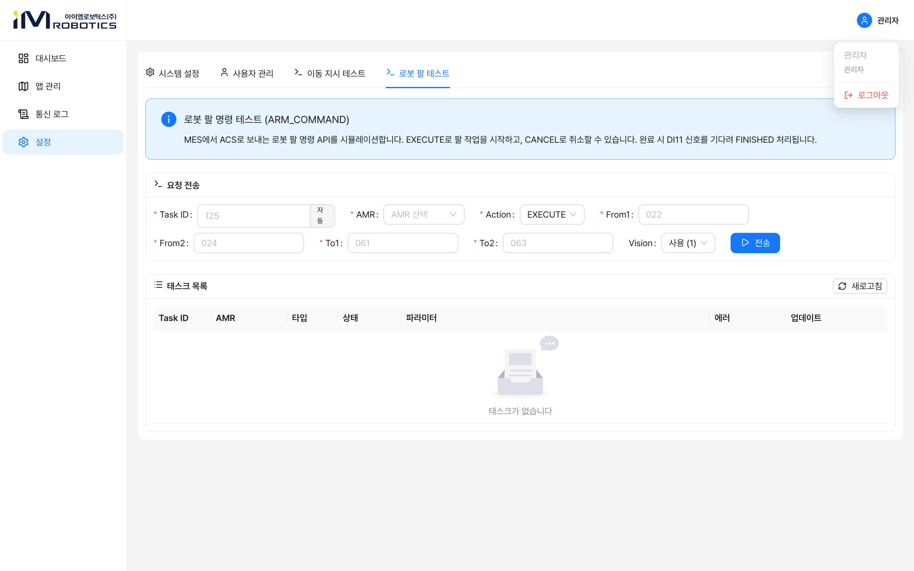

*사용자 메뉴*


**로그아웃**을 선택하면 localStorage의 세션 정보가 제거되고 `/login` 페이지로 이동합니다.

---

### 부록 A — AMR 상태 값 정의

| 상태 | 한글 | 설명 |
|---|---|---|
| `IDLE` | 대기 | 정상 연결됨, 명령 대기 중 |
| `MOVING` | 이동 | 이동 명령 수행 중 |
| `STOP` | 정지 | `stop_code` 기반 의도적 정지 |
| `ERROR` | 오류 | 에러 발생 (`additional_info.errors` 참조) |
| `E-STOP` | 비상정지 | 물리 비상정지 버튼 눌림 |
| `NO_CONN` | 연결 끊김 | 네트워크 단절 또는 전원 오프 |

### 부록 B — 태스크 상태 값 정의

| 상태 | 색상 | 의미 |
|---|---|---|
| `PENDING` | 주황 | 접수됨, 실행 대기 |
| `RUNNING` | 파랑 | 실행 중 |
| `FINISHED` / `DONE` | 초록 | 정상 완료 |
| `ERROR` / `FAILED` | 빨강 | 실패 (`error_code` 참조) |
| `CANCELLED` / `CANCELED` | 회색 | `CANCEL` 요청 또는 취소됨 |

_본 매뉴얼은 `docs/manual/generate.mjs`에 의해 실제 화면을 캡처해 자동 생성되었습니다._
